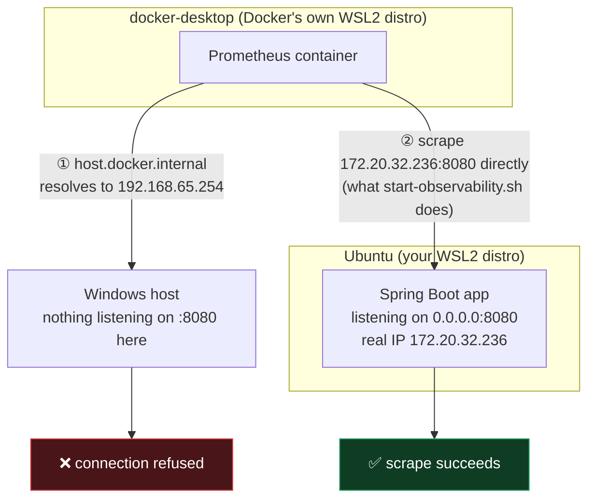

# Bug: a slow request with no way to see which step is slow

## The bug

`BuggyOrderService` (`src/main/java/.../buggy/BuggyOrderService.java`) does
four steps to answer one request:

```java
public Map<String, Object> getOrder(String orderId) {
    validate(orderId);                            // ~5ms
    Map<String, Object> order = fetchFromDatabase(orderId); // ~10ms
    double price = callPricingService(orderId);    // ~450ms - the real cost
    return assembleResponse(orderId, order, price); // ~5ms
}
```

The endpoint is slow (~480ms) and Spring's automatic instrumentation still
gives you `http.server.requests` as one aggregate timer and one root trace
span for the whole request — so you genuinely can tell "this endpoint is
slow." What you can't tell is **why**. Open that request's trace in Zipkin
and it's a single flat span with no children. Is it the DB call? The
pricing call? Validation? There's no way to know without reading the
source and guessing, or bisecting with print statements — exactly the
"healthy but slow, no idea where the time goes" problem from the earlier
[consumer-lag-demo](../consumer-lag-demo/bug-fix-notes-consumer-lag.md),
now inside a single request instead of across a stream of them.

## Reproduction

`LatencyObservabilityReproductionTest`:

- `givenBuggyEndpoint_whenCalled_thenNoPerStepTimingIsRecorded` — calls
  `/api/buggy/orders/42` and confirms the `order.pricing` timer's count
  never moves. The 450ms happened; nothing recorded it as its own
  observation.
- `givenFixedEndpoint_whenCalled_thenPerStepTimingRevealsWhichStepDominates`
  — same call shape against `/api/fixed/orders/42`, and now
  `order.pricing`'s recorded time is provably greater than
  `order.validate + order.fetch + order.assemble` combined.

Also verified against the real stack (`docker compose up -d`): both
endpoints measured **~480ms** over curl — identical real latency — but
pulling the trace for `/api/fixed/orders/{id}` from Zipkin's API shows the
breakdown directly:

```
http get /api/fixed/orders/{orderid}   483.8ms
  validate-order                         6.4ms
  fetch-order-from-db                   12.0ms
  call-pricing-service                 451.5ms   <- the answer
  assemble-response                      5.8ms
```

The buggy endpoint's trace for the same 480ms has exactly one span.

## The fix — instrument the steps, not just the endpoint

`FixedOrderService` and its four collaborators (`OrderValidator`,
`OrderDatabaseClient`, `PricingClient`, `OrderResponseAssembler`) do the
identical work with identical timings. The only difference is each
collaborator's method is annotated:

```java
@Observed(name = "order.pricing", contextualName = "call-pricing-service")
public double getPrice(String orderId) {
    sleep(450);
    return 19.99;
}
```

plus one bean registration that makes `@Observed` actually do something:

```java
@Bean
public ObservedAspect observedAspect(ObservationRegistry observationRegistry) {
    return new ObservedAspect(observationRegistry);
}
```

That's the whole fix. Micrometer's `ObservationRegistry` is wired to both a
`MeterRegistry` (because `micrometer-registry-prometheus` is on the
classpath) and a `Tracer` (because `micrometer-tracing-bridge-brave` +
`zipkin-reporter-brave` are). One `@Observed` annotation → one
`Observation` per call → both a Prometheus **Timer** and a Zipkin **child
span**, automatically correlated by trace id. Instrument once, get both a
trend view and a per-request view of the same call.

### Gotcha: why four beans instead of four private methods

`@Observed` (like `@Transactional`, `@Cacheable`, etc.) is implemented as a
Spring AOP proxy. A proxy only intercepts calls that arrive **from outside
the bean**, through the proxy. If `getOrder()` called
`this.callPricingService(orderId)` as a private method in the same class,
the annotation would be silently ignored — no error, no exception, just no
observation ever created. That's why the fixed version splits validation,
DB access, pricing, and assembly into four separate `@Component` beans
called from `FixedOrderService`: every call crosses a real bean boundary,
so the proxy actually gets a chance to intercept it. (This also happens to
be more realistic — a validator, a repository, and a downstream client
really would be separate collaborators in most real codebases.)

## Seeing it yourself

```
./start-observability.sh       # Zipkin :9411, Prometheus :9090, Grafana :3000
./mvnw spring-boot:run         # app on :8080
curl http://localhost:8080/api/fixed/orders/1
curl http://localhost:8080/api/buggy/orders/1
```

Use `./start-observability.sh`, not `docker compose up -d` directly — see
the networking note below for why.

- **Zipkin** (`http://localhost:9411`) — search by service
  `request-latency-tracing-demo`, open a `/api/fixed/orders/{orderid}`
  trace: a waterfall with `call-pricing-service` visibly dwarfing the other
  three spans. Open a `/api/buggy/orders/{orderid}` trace: one bar, no
  children.
- **Prometheus** (`http://localhost:9090`) — query `order_pricing_seconds_sum`,
  `order_validate_seconds_sum`, etc. (Micrometer turns `order.pricing` into
  `order_pricing_seconds_{count,sum,max}`).
- **Grafana** (`http://localhost:3000`, anonymous admin access — local demo
  only, never do this outside your own machine) — the "Request Latency:
  Buggy vs Fixed" dashboard is pre-provisioned with two panels: p95 latency
  for both endpoints side by side (nearly identical — that's the point),
  and the fixed endpoint's per-step breakdown underneath it (where that
  latency actually comes from).

**Why a script instead of a plain `prometheus.yml`**: the obvious scrape
target, `host.docker.internal:8080`, doesn't route to the app on this
project's own dev environment (WSL2 + Docker Desktop, one WSL distro named
`Ubuntu`). The short version, visually:



`docker-desktop` and `Ubuntu` are **sibling** WSL2 distros, not
parent/child — Docker Desktop runs every container inside its own distro,
never inside yours. `host.docker.internal` means "the Windows host" from
that sibling's point of view, which is a real, reachable machine — just
one with nothing bound to port 8080. Every attempted fix below was tried
and ruled out empirically, not just assumed:

| Attempted fix | Result |
|---|---|
| `server.address=0.0.0.0` in `application.properties` | No change — the app already binds to `*:8080` by default; confirmed with `ss -tlnp` |
| `extra_hosts: ["host.docker.internal:host-gateway"]` in `docker-compose.yml` | No change — `host.docker.internal` still resolves to the same IP either way |
| Docker Desktop → Settings → Resources → WSL Integration, explicitly enabling the `Ubuntu` distro (not just the "default WSL distro" checkbox) + restarting Docker Desktop | No change |

In every case `host.docker.internal` resolved to `192.168.65.254` from
inside a container, and every connection attempt got a clean **`connection
refused`** — not a timeout. That distinction matters: a timeout would mean
"no route to that address." A refusal means the packet *did* reach a real
machine and got a TCP reset back because nothing is listening on port 8080
*there*.

The diagram's shape is confirmed directly by `wsl -l -v` on the Windows
host — two distros, siblings, not parent/child:

```
NAME              STATE           VERSION
* Ubuntu            Running         2
  docker-desktop    Running         2
```

WSL Integration only grants the `docker` CLI/daemon socket access from
within `Ubuntu`; it doesn't merge `Ubuntu`'s network namespace into "host"
as Docker Desktop defines it. This is Docker Desktop's WSL2 architecture
working as designed, not a misconfiguration — there is no toggle that
changes it.

What *does* work: sibling WSL2 distros can reach each other directly over
the shared internal Hyper-V vSwitch. `start-observability.sh` uses exactly
that — it resolves `Ubuntu`'s own real IP with `ip route get 1.1.1.1` and
renders `observability/prometheus/prometheus.yml` from
`prometheus.yml.template` before starting the stack, so Prometheus always
gets a real, reachable address instead of a hostname that may or may not
route correctly on your setup. The generated `prometheus.yml` is
git-ignored (it's machine-specific); only the template is committed. If
`ip route` isn't available (non-Linux), the script falls back to
`host.docker.internal`.

## Rule of thumb

An aggregate timer on an endpoint tells you *that* something is slow, not
*what*. Once you have more than one meaningfully expensive step in a
request, instrument each step, not just the boundary — a slow-call demo
this simple already needed it, and a real endpoint doing an actual DB
query, an actual downstream HTTP call, and actual business logic needs it
far more. `@Observed` (or manual `Observation` spans) makes that
breakdown exist as data instead of a guess, and — because metrics and
traces share one Observation API in Spring Boot 3+ — costs one annotation
per step, not two separate instrumentation efforts.
